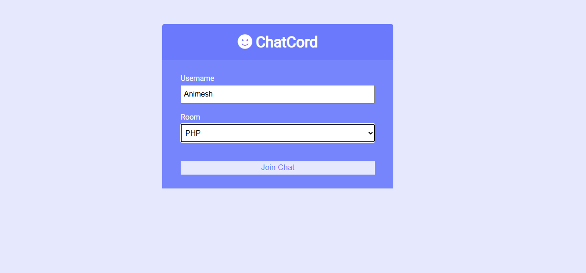
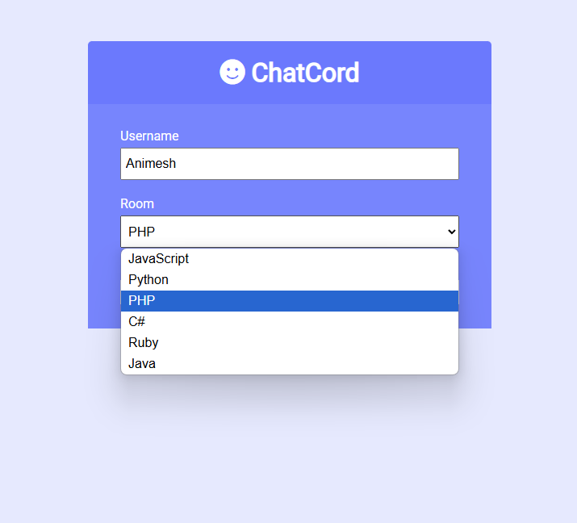
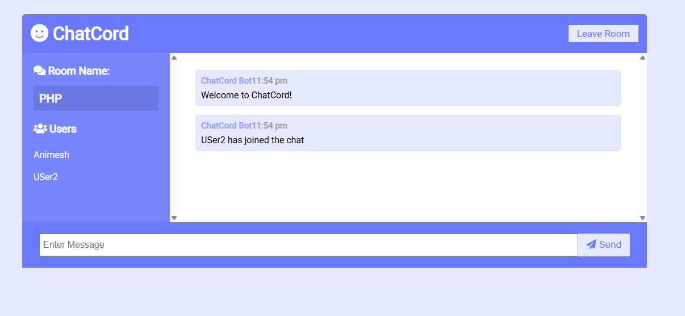
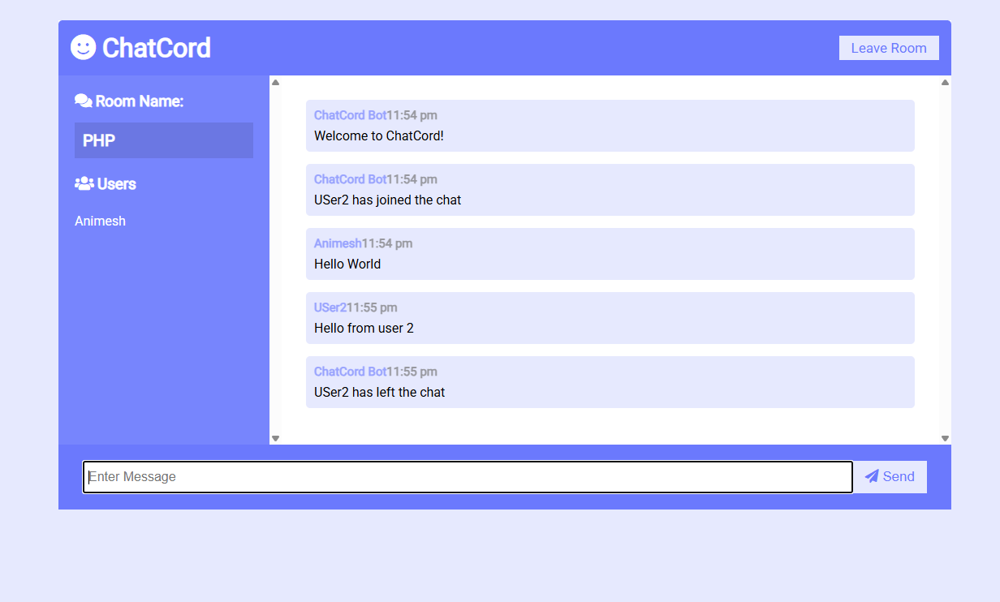

# 🔗 ChatCord – Built with Node.js, Express, and Socket.io

## 🚀 Overview  
This is a Realtime Chat Application built using Node.js, Express, and Socket.io. It allows users to join chat rooms, send messages, and interact with others in real time. The app is designed to provide a seamless and responsive chatting experience.

---

## 🔥 Features  
✅ Join specific chat rooms  
✅ Send and receive messages in real time  
✅ View a dynamic list of users in the room

---

## 📸 Screenshots 

 




---

## Contributing

Contributions are welcome! If you have any suggestions, bug reports, or improvements, feel free to open an issue or submit a pull request.

1. **Fork the repository.**
2. **Create a new branch:**
    ```bash
    git checkout -b feature/your-feature-name
    ```
3. **Make your changes and commit them:**
    ```bash
    git commit -m 'Add some feature'
    ```
4. **Push to the branch:**
    ```bash
    git push origin feature/your-feature-name
    ```
5. **Open a pull request.**

---

## License

This is licensed under the [MIT License](https://choosealicense.com/licenses/mit/), allowing for open collaboration and innovation in the spirit of shared knowledge.

---

## Contact

If you have any questions or feedback, feel free to reach out:

- **Email:** nilawaranimesh@gmail.com

---

## 🔗 Links

[](https://www.linkedin.com/in/animesh-nilawar/)
